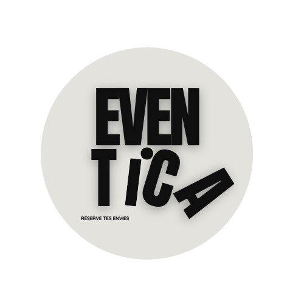
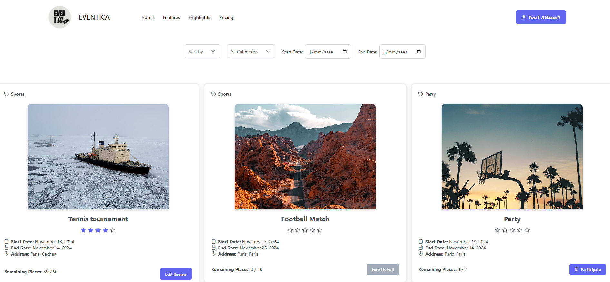
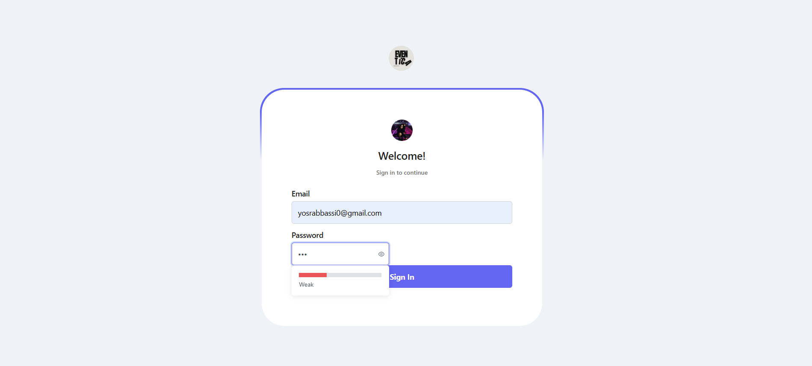
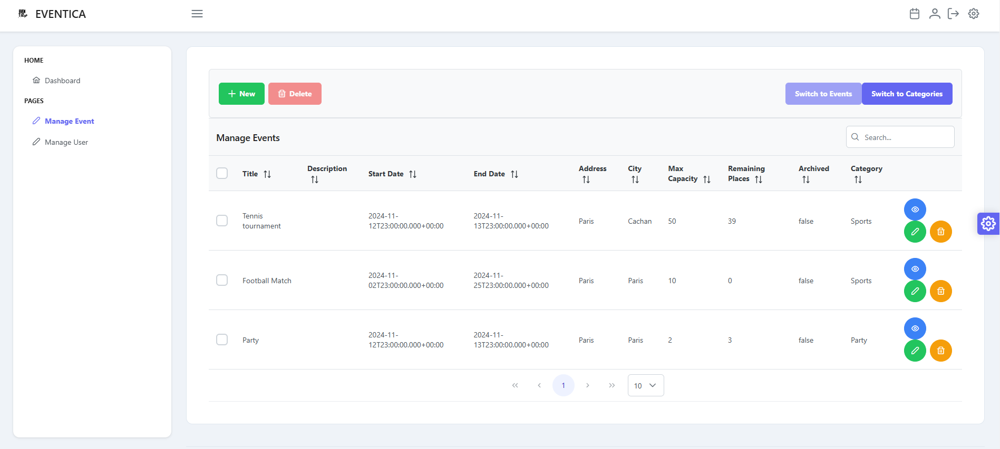
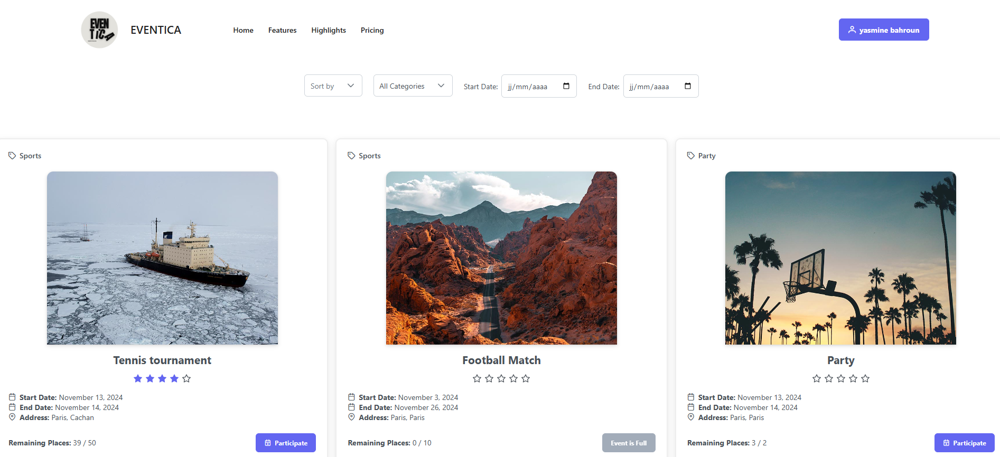

<p align="center"> 
  
</p>

# Eventica

## Description du Projet

**Eventica** est une application web permettant aux utilisateurs de naviguer dans une liste d'événements, de s'inscrire à des événements, et de donner leur avis après leur participation. Elle offre une interface intuitive et moderne, ainsi qu'un système de gestion backend robuste pour gérer les événements et les inscriptions.

Ce projet est basé sur une architecture moderne avec Angular pour le frontend et Spring Boot pour le backend, intégrés via des API REST et utilisant Docker pour simplifier le déploiement et la gestion du serveur backend.

## Table des Matières

- [Technologies Utilisées](#technologies-utilisées)
- [Fonctionnalités](#fonctionnalités)
- [Prérequis](#prérequis)
- [Installation et Exécution](#installation-et-exécution)
  - [Backend - Spring Boot](#backend---spring-boot)
  - [Frontend - Angular](#frontend---angular)
- [Structure du Projet](#structure-du-projet)
- [Utilisation](#Utilisation)
- [Vidéo démonstrative](#Vidéo-démonstrative)
- [Contact](#contact)

---

## Technologies Utilisées

- **Frontend** : Angular
- **Backend** : Spring Boot
- **Base de Données** : PostgreSQL (via Docker)
- **Outils de Déploiement** : Docker et Docker Compose

---

## Fonctionnalités

1. **Navigation dans la Liste des Événements** : Les utilisateurs peuvent visualiser tous les événements, filtrés par catégories, date, ou popularité.
2. **Inscription aux Événements** : Chaque utilisateur peut s’inscrire aux événements qui l’intéressent.
3. **Avis sur les Événements** : Les utilisateurs peuvent donner leur avis sur les événements auxquels ils ont participé, offrant des retours pour améliorer l'organisation future.

---

## Prérequis

Avant de commencer, assurez-vous d’avoir les éléments suivants installés :

- **Node.js** (version recommandée : >= 14.x)
- **Angular CLI** (version recommandée : >= 12.x)
- **Docker** (version recommandée : >= 20.x)
- **Docker Compose** (version recommandée : >= 1.27)

---

## Installation et Exécution

### Backend - Spring Boot

1. **Configuration de la Base de Données** : La base de données PostgreSQL est incluse dans le fichier `docker-compose.yml` et sera configurée automatiquement.
2. **Lancer le Serveur Backend avec Docker Compose** :
   
   Depuis le répertoire principal du projet, exécutez la commande suivante pour démarrer le serveur backend :
   ```bash

   docker-compose up -d

Le backend sera accessible à [http://localhost:8089](http://localhost:8089).


## Frontend - Angular

### Installer les Dépendances Angular
Depuis le dossier `frontend`, exécutez :

npm install
## Configuration de l'API dans Angular
Modifiez le fichier `environment.ts` dans `src/environments` pour pointer vers `http://localhost:8089`.

## Lancer le Serveur Frontend

ng serve

## Utilisation
### Page d'accueil


<br>

Pour se connecter en tant qu'**admin**, vous pouvez utiliser le compte admin déjà existant dans la base :

- **Email** : yosrabbassi0@gmail.com  
- **Password** : 123123

<br>

Pour se connecter en tant qu'**utilisateur simple**, vous pouvez créer un nouveau compte ou utiliser un compte utilisateur déjà existant dans la base :

- **Email** : yasmine@gmail.com  
- **Password** : 123



L'**interface d'administration** permet de gérer facilement les événements ainsi que leurs catégories et les utilisateurs, offrant des options pour créer, modifier ou supprimer des événements, des catégories et des utilisateurs et suivre l'activité des utilisateurs sur la plateforme.


L'**interface utilisateur** affiche une liste d'événements , avec des options de filtrage pour affiner la recherche. Les utilisateurs peuvent trier les événements par **catégorie**, **date** ou **disponibilité des places**, facilitant ainsi la sélection des événements qui les intéressent le plus.



## Vidéo démonstrative
[Télécharger la vidéo de démonstration](./demo.mp4)

## Contact
Pour toute question, veuillez nous contacter à :

Email : yosr.abbassi@epfedu.fr
        , yasmine.bahroun@epfedu.fr

Merci d'avoir choisi Eventica 😊 !
